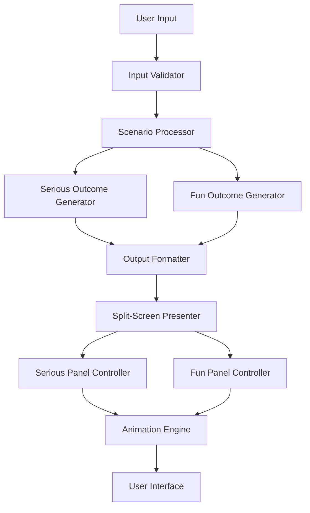

# Design Document

## Overview

The AI What If Simulator is designed as a modular system that processes user scenarios through two distinct analysis pipelines: a serious outcome generator focused on realistic cause-and-effect reasoning, and a creative outcome generator that produces humorous or surreal interpretations. The system leverages AI language models to generate contextually appropriate responses while maintaining clear separation between the two output types.

## Architecture

The system follows a pipeline architecture with an enhanced presentation layer featuring split-screen UI and animation system:



### Core Components

1. **Input Handler**: Receives and validates user "What if..." scenarios with animated interactions
2. **Scenario Processor**: Analyzes and structures the input for processing
3. **Dual Outcome Generators**: Separate engines for serious and fun responses
4. **Output Formatter**: Structures and presents the results
5. **Split-Screen Presenter**: Manages dual-panel layout and coordinated animations
6. **Panel Controllers**: Handle individual panel behavior and styling
7. **Animation Engine**: Orchestrates all UI animations and interactive effects

## Components and Interfaces

### Input Validator
- **Purpose**: Validates and sanitizes user input
- **Interface**: `validateScenario(input: string) => ValidationResult`
- **Responsibilities**:
  - Check for minimum content requirements
  - Filter inappropriate content
  - Extract the core scenario from user input

### Scenario Processor
- **Purpose**: Analyzes the scenario structure and context
- **Interface**: `processScenario(scenario: string) => ProcessedScenario`
- **Responsibilities**:
  - Identify key elements (actors, actions, context)
  - Determine scenario type (personal, professional, historical, etc.)
  - Prepare context for outcome generators

### Serious Outcome Generator
- **Purpose**: Creates realistic, logical consequence analysis
- **Interface**: `generateSeriousOutcome(scenario: ProcessedScenario) => string`
- **Responsibilities**:
  - Apply cause-and-effect reasoning
  - Consider real-world constraints and factors
  - Generate structured, informative analysis

### Fun Outcome Generator
- **Purpose**: Creates creative, entertaining interpretations
- **Interface**: `generateFunOutcome(scenario: ProcessedScenario) => string`
- **Responsibilities**:
  - Apply creative and humorous thinking
  - Generate unexpected but coherent outcomes
  - Maintain appropriate content standards

### Output Formatter
- **Purpose**: Structures the dual outcomes for presentation
- **Interface**: `formatResults(serious: string, fun: string) => FormattedOutput`
- **Responsibilities**:
  - Apply consistent formatting
  - Ensure clear distinction between versions
  - Optimize readability

### Split-Screen Presenter
- **Purpose**: Manages the dual-panel layout and coordinated presentation
- **Interface**: `presentResults(formattedOutput: FormattedOutput) => void`
- **Responsibilities**:
  - Initialize split-screen layout
  - Coordinate simultaneous panel animations
  - Manage panel state and interactions

### Serious Panel Controller
- **Purpose**: Handles serious outcome panel behavior and styling
- **Interface**: `displaySeriousOutcome(content: string, animations: AnimationConfig) => void`
- **Responsibilities**:
  - Apply professional styling (calm colors, glowing borders)
  - Execute fade-in animations with professional feel
  - Handle hover effects and parallax interactions

### Fun Panel Controller
- **Purpose**: Manages fun outcome panel with playful interactions
- **Interface**: `displayFunOutcome(content: string, animations: AnimationConfig) => void`
- **Responsibilities**:
  - Apply vibrant styling with color-shifting gradients
  - Execute spin/wiggle entrance animations
  - Trigger confetti effects and celebratory animations

### Animation Engine
- **Purpose**: Orchestrates all UI animations and interactive feedback
- **Interface**: `executeAnimation(type: AnimationType, target: Element, config: AnimationConfig) => Promise<void>`
- **Responsibilities**:
  - Manage entrance animations for both panels
  - Handle interactive effects (hover, click, parallax)
  - Control loading states and transitions
  - Execute theme toggle animations (sun-moon morphing)

## Data Models

### ValidationResult
```typescript
interface ValidationResult {
  isValid: boolean;
  sanitizedInput: string;
  errorMessage?: string;
}
```

### ProcessedScenario
```typescript
interface ProcessedScenario {
  originalText: string;
  scenarioType: 'personal' | 'professional' | 'historical' | 'hypothetical';
  keyElements: {
    actors: string[];
    actions: string[];
    context: string;
  };
  complexity: 'simple' | 'moderate' | 'complex';
}
```

### FormattedOutput
```typescript
interface FormattedOutput {
  seriousVersion: string;
  funVersion: string;
  metadata: {
    processingTime: number;
    scenarioType: string;
  };
}
```

### AnimationConfig
```typescript
interface AnimationConfig {
  duration: number;
  easing: string;
  delay?: number;
  effects?: {
    confetti?: boolean;
    parallax?: boolean;
    colorShift?: boolean;
    bounce?: boolean;
  };
}
```

### PanelState
```typescript
interface PanelState {
  isVisible: boolean;
  isAnimating: boolean;
  content: string;
  theme: 'serious' | 'fun';
  interactionState: 'idle' | 'hover' | 'active';
}
```

### UIInteractionEvent
```typescript
interface UIInteractionEvent {
  type: 'input' | 'submit' | 'hover' | 'theme-toggle';
  target: string;
  timestamp: number;
  animationTrigger?: AnimationType;
}
```

## UI/UX Design

### Split-Screen Layout Architecture

The interface uses a responsive split-screen design that emphasizes the duality between serious and fun outcomes:

#### Layout Structure
- **Left Panel (Serious)**: Professional styling with calm colors, subtle shadows, and glowing borders
- **Right Panel (Fun)**: Vibrant styling with dynamic gradients, playful borders, and animated backgrounds
- **Input Section**: Centered above panels with animated placeholder text and interactive submit button
- **Theme Toggle**: Positioned for easy access with smooth sun-moon morphing animation

#### Animation System

**Entrance Animations:**
- Serious Panel: Smooth fade-in with gentle slide from left, professional glow effect
- Fun Panel: Playful spin or wiggle entrance with bounce effect and color transitions
- Coordinated timing ensures both panels appear simultaneously but with distinct personalities

**Interactive Animations:**
- Hover Effects: Parallax tilt on both panels with different intensities
- Submit Button: Bounce on hover, confetti explosion on click
- Loading States: Thinking emoji bounce or typing robot animation
- Confetti System: Emoji confetti triggered on fun panel result display

**Theme Transitions:**
- Dark/Light Toggle: Smooth sun-moon morphing with color palette transitions
- Panel styling adapts while maintaining personality distinction

### Responsive Design Considerations

- **Desktop**: Full split-screen with side-by-side panels
- **Tablet**: Stacked panels with maintained animation effects
- **Mobile**: Single column with swipe navigation between serious/fun views

### Accessibility Features

- **Reduced Motion**: Respect user preferences for reduced motion
- **Screen Readers**: Proper ARIA labels for panel distinction
- **Keyboard Navigation**: Full keyboard accessibility for all interactive elements
- **Color Contrast**: Ensure readability in both light and dark themes

## Error Handling

### Input Validation Errors
- Empty or null input: Prompt for valid scenario
- Inappropriate content: Request alternative phrasing
- Too vague scenarios: Ask for clarification while providing best-effort analysis

### Processing Errors
- AI generation failures: Retry with simplified prompts
- Timeout scenarios: Provide partial results with explanation
- Content filtering issues: Generate alternative approaches

### Fallback Strategies
- If serious generation fails: Provide structured analysis framework
- If fun generation fails: Offer creative prompts or examples
- If both fail: Provide scenario analysis template for user completion

## Testing Strategy

### Unit Testing
- Input validation with various scenario types
- Individual outcome generator testing with known inputs
- Output formatting verification
- Error handling for edge cases

### Integration Testing
- End-to-end scenario processing pipeline
- AI model integration and response quality
- Performance testing with various input complexities
- Content appropriateness validation

### User Acceptance Testing
- Scenario variety testing (personal, professional, historical)
- Output quality assessment for both serious and fun versions
- User experience flow validation
- Response time and system reliability testing

## Implementation Considerations

### AI Model Integration
- Use structured prompts to ensure consistent output quality
- Implement prompt engineering for distinct serious vs. fun personalities
- Consider model temperature settings (lower for serious, higher for creative)
- Implement content filtering and safety measures

### UI/Animation Performance
- Use CSS transforms and GPU acceleration for smooth animations
- Implement animation queuing to prevent conflicts
- Optimize confetti particle systems for performance
- Use requestAnimationFrame for smooth 60fps animations
- Consider reduced motion preferences for accessibility

### React Frontend Architecture
- Implement React component-based architecture with hooks
- Use ReactBits library for pre-built UI components and animations
- Combine ReactBits with Framer Motion for custom animations
- Leverage ReactBits ThemeProvider and built-in state management
- Use ReactBits accessibility features and responsive utilities
- Implement React Suspense for loading states

### Performance Optimization
- Cache common scenario patterns for faster processing
- Implement parallel processing for serious and fun generators
- Optimize prompt length and complexity for response time
- Consider rate limiting for API usage management
- Lazy load animation assets and optimize bundle size

### Cross-Browser Compatibility
- Test animations across major browsers (Chrome, Firefox, Safari, Edge)
- Implement fallbacks for older browsers
- Use CSS feature detection for advanced animations
- Ensure consistent experience across devices

### Scalability
- Design for stateless operation to support multiple concurrent users
- Implement logging for usage analytics and improvement insights
- Plan for different AI model backends (OpenAI, Anthropic, local models)
- Consider batch processing capabilities for multiple scenarios
- Optimize animation performance for concurrent users