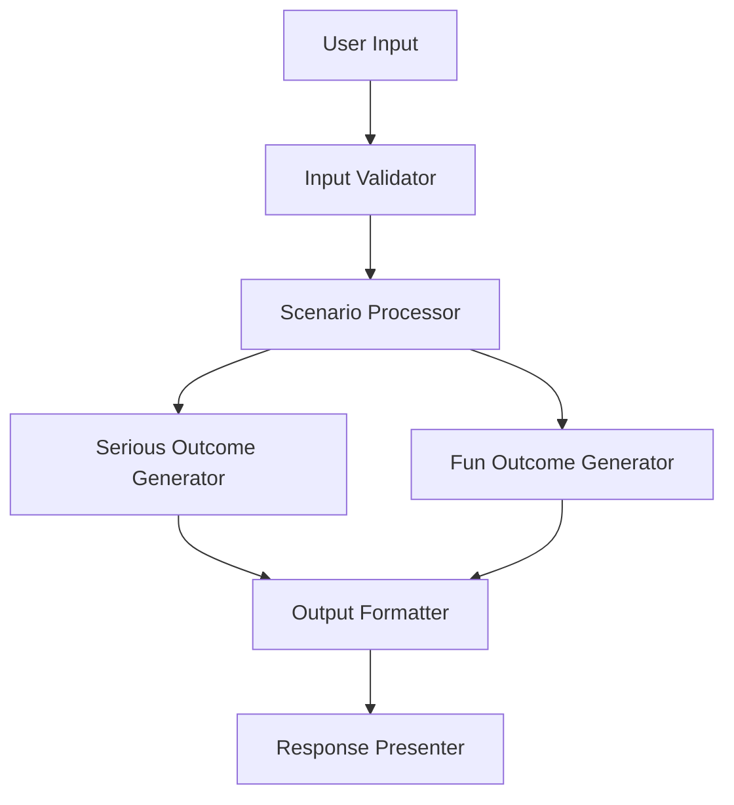

# Design Document

## Overview

The AI What If Simulator is designed as a modular system that processes user scenarios through two distinct analysis pipelines: a serious outcome generator focused on realistic cause-and-effect reasoning, and a creative outcome generator that produces humorous or surreal interpretations. The system leverages AI language models to generate contextually appropriate responses while maintaining clear separation between the two output types.

## Architecture

The system follows a pipeline architecture with the following key components:



### Core Components

1. **Input Handler**: Receives and validates user "What if..." scenarios
2. **Scenario Processor**: Analyzes and structures the input for processing
3. **Dual Outcome Generators**: Separate engines for serious and fun responses
4. **Output Formatter**: Structures and presents the results
5. **Response Presenter**: Delivers formatted results to the user

## Components and Interfaces

### Input Validator
- **Purpose**: Validates and sanitizes user input
- **Interface**: `validateScenario(input: string) => ValidationResult`
- **Responsibilities**:
  - Check for minimum content requirements
  - Filter inappropriate content
  - Extract the core scenario from user input

### Scenario Processor
- **Purpose**: Analyzes the scenario structure and context
- **Interface**: `processScenario(scenario: string) => ProcessedScenario`
- **Responsibilities**:
  - Identify key elements (actors, actions, context)
  - Determine scenario type (personal, professional, historical, etc.)
  - Prepare context for outcome generators

### Serious Outcome Generator
- **Purpose**: Creates realistic, logical consequence analysis
- **Interface**: `generateSeriousOutcome(scenario: ProcessedScenario) => string`
- **Responsibilities**:
  - Apply cause-and-effect reasoning
  - Consider real-world constraints and factors
  - Generate structured, informative analysis

### Fun Outcome Generator
- **Purpose**: Creates creative, entertaining interpretations
- **Interface**: `generateFunOutcome(scenario: ProcessedScenario) => string`
- **Responsibilities**:
  - Apply creative and humorous thinking
  - Generate unexpected but coherent outcomes
  - Maintain appropriate content standards

### Output Formatter
- **Purpose**: Structures the dual outcomes for presentation
- **Interface**: `formatResults(serious: string, fun: string) => FormattedOutput`
- **Responsibilities**:
  - Apply consistent formatting
  - Ensure clear distinction between versions
  - Optimize readability

## Data Models

### ValidationResult
```typescript
interface ValidationResult {
  isValid: boolean;
  sanitizedInput: string;
  errorMessage?: string;
}
```

### ProcessedScenario
```typescript
interface ProcessedScenario {
  originalText: string;
  scenarioType: 'personal' | 'professional' | 'historical' | 'hypothetical';
  keyElements: {
    actors: string[];
    actions: string[];
    context: string;
  };
  complexity: 'simple' | 'moderate' | 'complex';
}
```

### FormattedOutput
```typescript
interface FormattedOutput {
  seriousVersion: string;
  funVersion: string;
  metadata: {
    processingTime: number;
    scenarioType: string;
  };
}
```

## Error Handling

### Input Validation Errors
- Empty or null input: Prompt for valid scenario
- Inappropriate content: Request alternative phrasing
- Too vague scenarios: Ask for clarification while providing best-effort analysis

### Processing Errors
- AI generation failures: Retry with simplified prompts
- Timeout scenarios: Provide partial results with explanation
- Content filtering issues: Generate alternative approaches

### Fallback Strategies
- If serious generation fails: Provide structured analysis framework
- If fun generation fails: Offer creative prompts or examples
- If both fail: Provide scenario analysis template for user completion

## Testing Strategy

### Unit Testing
- Input validation with various scenario types
- Individual outcome generator testing with known inputs
- Output formatting verification
- Error handling for edge cases

### Integration Testing
- End-to-end scenario processing pipeline
- AI model integration and response quality
- Performance testing with various input complexities
- Content appropriateness validation

### User Acceptance Testing
- Scenario variety testing (personal, professional, historical)
- Output quality assessment for both serious and fun versions
- User experience flow validation
- Response time and system reliability testing

## Implementation Considerations

### AI Model Integration
- Use structured prompts to ensure consistent output quality
- Implement prompt engineering for distinct serious vs. fun personalities
- Consider model temperature settings (lower for serious, higher for creative)
- Implement content filtering and safety measures

### Performance Optimization
- Cache common scenario patterns for faster processing
- Implement parallel processing for serious and fun generators
- Optimize prompt length and complexity for response time
- Consider rate limiting for API usage management

### Scalability
- Design for stateless operation to support multiple concurrent users
- Implement logging for usage analytics and improvement insights
- Plan for different AI model backends (OpenAI, Anthropic, local models)
- Consider batch processing capabilities for multiple scenarios